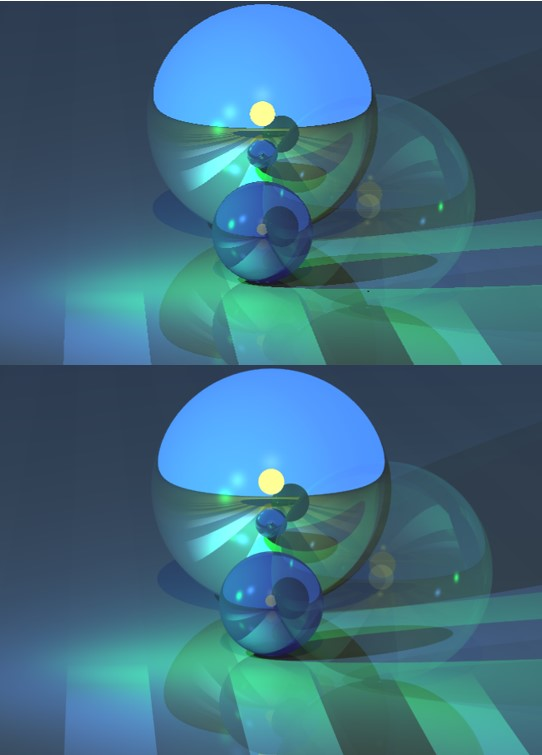
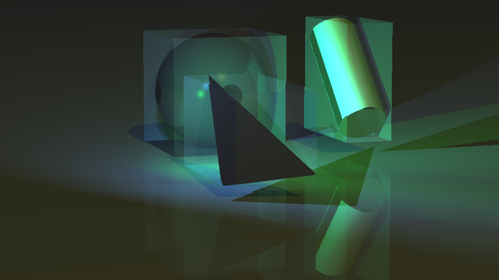

# RayTracing

RayTracing is a Java-based ray tracing engine that renders images with shadows, reflections, and refractions according to the Phong lighting model. The engine improves the quality of the image by using techniques such as super-sampling, Boundary Volume Hierarchy (BVH) optimization, adaptive super-sampling, and multi-threading.

This project was developed using Test-Driven Development (TDD) and programming principles such as pair programming, refactoring, and Agile Development.

## Getting Started

To use the engine, you will need to have Java 11 or later installed on your system. You can then clone or download the repository and import it into your preferred Java development environment.

## Features

- Phong lighting model for calculating shading and reflections

- Shadows, reflections, and refractions
- Super-sampling for the antialising effect. (the image below was created using super sampling)

- BVH optimization for faster rendering

- Adaptive super-sampling for even better image quality and faster rendering
- Multi-threading for faster rendering on multi-core systems

## Usage

The engine can be used by calling the `render` method and passing in the necessary parameters such as the scene to be rendered and the output file. Example usage can be found in the `main` method of the `RayTracer` class.

## Examples

Here are an example of video that rendered using the RayTracing engine by combining several images:

